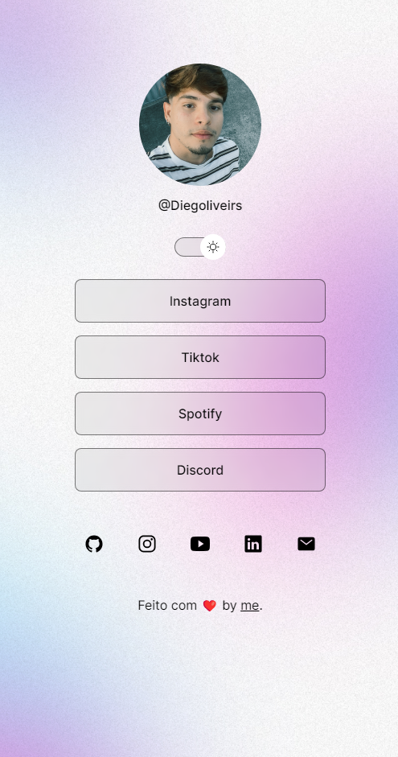

## Mudanças Recentes

### HTML

- Adição de novos elementos HTML, como o switch para alternar entre temas claro e escuro e links adicionais para redes sociais.

### CSS

- Atualização das variáveis CSS para definir cores, imagens de fundo e estilos de elementos conforme o tema escolhido.

### JavaScript

- A função `toggleMode()` foi atualizada para alternar entre os temas claro e escuro, e para trocar dinamicamente a imagem do perfil dependendo do tema escolhido.

### Screenshot



### Como Usar

1. Clone este repositório:
   ```bash
   git clone https://github.com/seu-usuario/link-hub.git
2. Abra o arquivo `index.html` em seu navegador.

## Personalização

- Para alterar a imagem do perfil, subtitua `assets/MeuIcone.JPEG` por sua propria imagem, mantendo o formato e dimenções apropriadas.

## Contribuições

- Contribuições são bem-vindas! Sinta-se à vontade para abrir um problema ou enviar um pull request.

## Autor

- Diego Oliveira, junto com Rocketseat.

## Licença

- Este projeto está licenciado sob a licença MIT. Veja o arquivo LICENSE para mais detalhes.